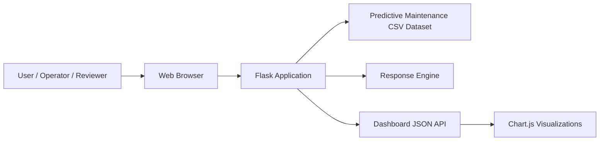
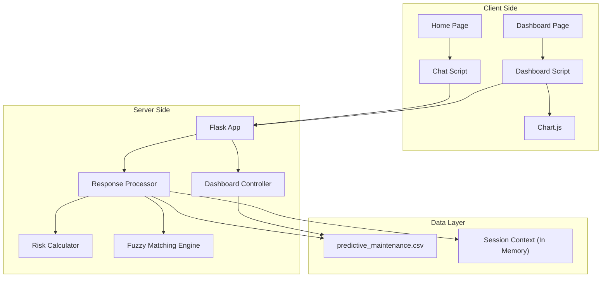
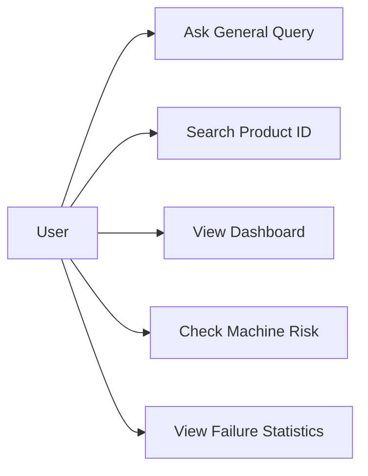
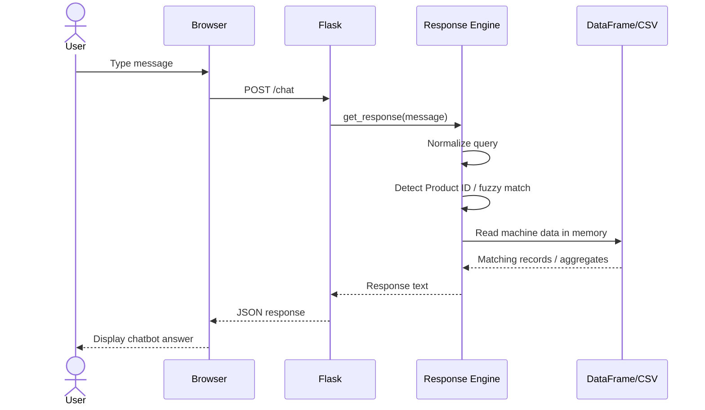
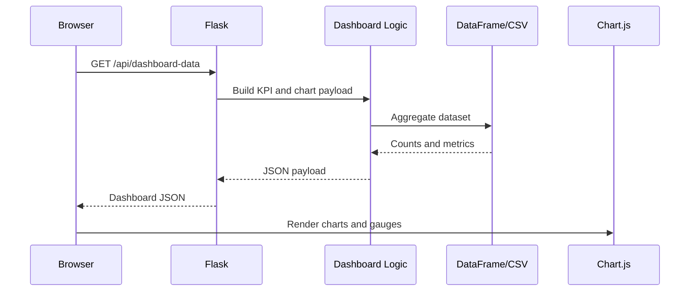
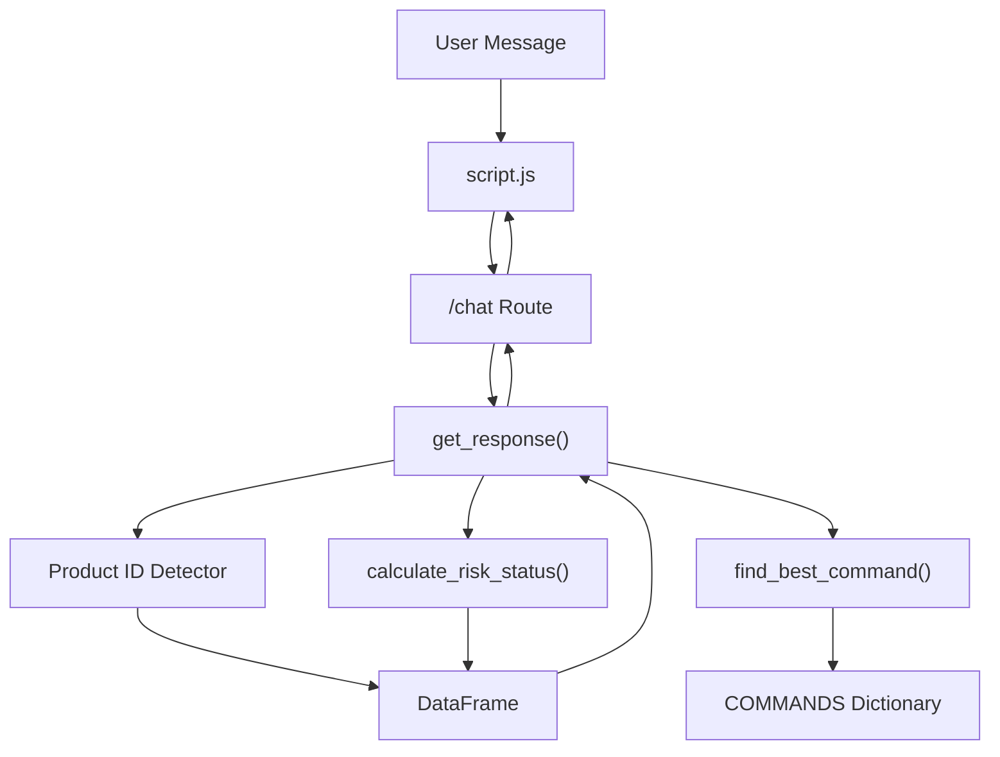
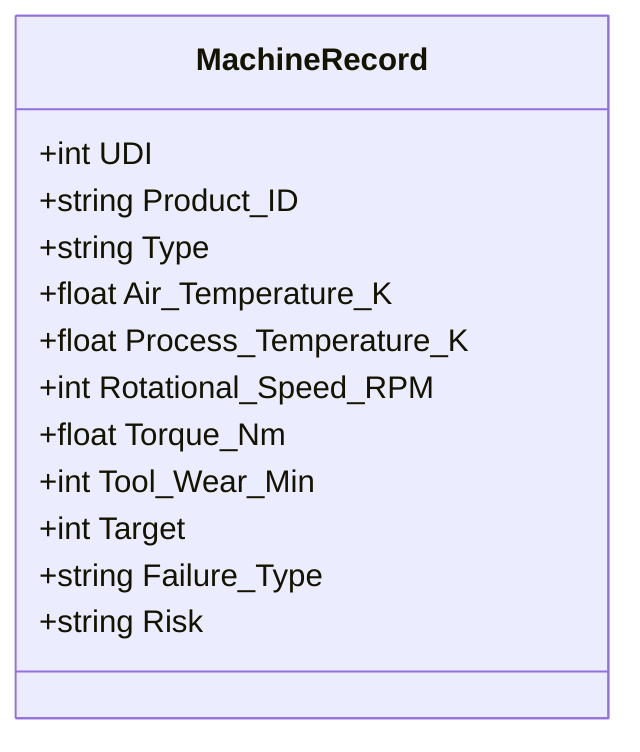

# Manufacturing Infrastructure Chatbot - HLD and LLD

## 1. Project Title
**Manufacturing Infrastructure Chatbot for Predictive Maintenance Monitoring**

## 2. Executive Summary
The Manufacturing Infrastructure Chatbot is a web-based application that enables users to query machine health, failure statistics, and maintenance indicators in natural language. The solution is implemented using a Flask backend, a CSV-based predictive maintenance dataset, fuzzy intent matching through RapidFuzz, and a dashboard UI for analytics visualization.

The system is designed to simplify access to machine information for non-technical users. Instead of navigating raw datasets, users can ask questions such as "failed machines", "average RPM", or a specific machine Product ID like `L47181`, and the system returns meaningful responses. A dashboard complements the chatbot by displaying KPIs, failure distributions, and sample machine data.

## 3. HLD

### 3.1 Purpose
The purpose of this document is to define the high-level architecture of the Manufacturing Infrastructure Chatbot, its major components, external interfaces, and overall data flow.

### 3.2 Scope
This system covers:

- Natural-language machine information queries
- Machine-level Product ID lookup
- Failure and maintenance summary reporting
- Dashboard-based visualization of machine analytics
- Risk classification using threshold-based business logic

This system currently does not cover:

- Real-time IoT sensor ingestion
- User authentication and role-based access
- Persistent session storage
- Model training or ML inference services
- Cloud-native deployment automation

### 3.3 Intended Audience
This document is intended for:

- Project reviewers
- Developers
- System designers
- Academic evaluators
- Industry mentors

### 3.4 Business Problem
Manufacturing environments generate large amounts of machine health data, but operators and students often find it difficult to extract insights quickly. Raw data tables are hard to interpret, and users may not know SQL or analytics tools. This project solves that by providing a natural-language chatbot and visual dashboard for quick machine monitoring.

### 3.5 Solution Overview
The proposed system provides a lightweight analytics platform with two user interaction modes:

- A chatbot UI for plain-English maintenance queries
- A dashboard UI for KPI cards, charts, and machine data tables

The application reads machine data from a local CSV file, processes user requests in the Flask backend, performs intent detection using keyword and fuzzy matching, and returns either textual answers or structured dashboard JSON.

### 3.6 High-Level Architecture

#### Main Components
- **Presentation Layer**
  - `templates/index.html`
  - `templates/dashboard.html`
  - `static/style.css`
  - `static/script.js`
  - `static/dashboard.js`
- **Application Layer**
  - `app.py`
- **Data Layer**
  - `data/predictive_maintenance.csv`
- **Libraries**
  - Flask
  - pandas
  - rapidfuzz
  - Chart.js

### 3.7 HLD Diagram - System Context Diagram
Use this in the HLD because it shows the full solution at a business/system level.



### 3.8 HLD Diagram - Container / Component View
Use this in the HLD to show the major deployable parts.



### 3.9 Major Functional Modules

#### 3.9.1 Chatbot Query Module
Accepts natural-language user messages and identifies either:

- A machine-specific query using Product ID
- A general command using fuzzy matching
- A follow-up query using session context

#### 3.9.2 Analytics Module
Computes:

- Total machines
- Working vs failed machines
- Failure rate
- Failure type counts
- Machine type counts
- Average RPM, temperature, torque, and tool wear

#### 3.9.3 Risk Assessment Module
Applies rule-based thresholds to identify:

- Safe
- Elevated
- High Warning
- Critical (Failed)

#### 3.9.4 Dashboard Data Service
Builds structured JSON data for:

- KPI cards
- Doughnut chart
- Bar chart
- Gauge views
- Sample machine table
- At-risk machine list

### 3.10 Technology Stack

| Layer | Technology |
|---|---|
| Backend | Python, Flask |
| Data Processing | pandas |
| NLP Matching | RapidFuzz |
| Frontend | HTML, CSS, JavaScript |
| Charts | Chart.js |
| Data Source | CSV file |

### 3.11 Deployment View
The current deployment is a simple monolithic application:

- Frontend and backend run together in one Flask app
- Dataset is stored locally in the project
- No separate database server is used
- No reverse proxy or container orchestration is required for the current version

### 3.12 Key Assumptions
- Dataset is available locally and readable at startup
- Only one application instance is running
- Session context can remain in memory
- Users are within a controlled/demo environment
- Dataset structure remains stable

### 3.13 Non-Functional Requirements

#### Security Aspects
- Input should be validated before processing
- The current project assumes trusted local usage
- No authentication exists in the current version
- For production, HTTPS, login, and API protection should be added

#### Performance Aspects
- Data file is loaded once during startup
- Most calculations are fast because data size is limited to 10,000 rows
- Fuzzy matching improves usability with acceptable overhead

#### Availability
- Application availability depends on the Flask server and dataset availability
- If the CSV is missing or corrupted, the system cannot serve valid responses

#### Maintainability
- Logic is centralized in `app.py`, which is simple for small projects
- Future maintainability can be improved by splitting routes, services, and data access into separate modules

### 3.14 HLD References
- [app.py](/C:/Users/ACER/manufacturing-infrastructure-chatbot/app.py)
- [index.html](/C:/Users/ACER/manufacturing-infrastructure-chatbot/templates/index.html)
- [dashboard.html](/C:/Users/ACER/manufacturing-infrastructure-chatbot/templates/dashboard.html)
- [script.js](/C:/Users/ACER/manufacturing-infrastructure-chatbot/static/script.js)
- [dashboard.js](/C:/Users/ACER/manufacturing-infrastructure-chatbot/static/dashboard.js)
- [predictive_maintenance.csv](/C:/Users/ACER/manufacturing-infrastructure-chatbot/data/predictive_maintenance.csv)

## 4. LLD

### 4.1 Purpose
The purpose of the LLD is to describe internal modules, route behavior, data structures, processing flow, and interface details at implementation level.

### 4.2 Current Project Statistics
- Total machines: `10000`
- Working machines: `9661`
- Failed machines: `339`
- Failure rate: `3.39%`
- Machine types: `L = 6000`, `M = 2997`, `H = 1003`
- Failure types: `No Failure = 9652`, `Heat Dissipation Failure = 112`, `Power Failure = 95`, `Overstrain Failure = 78`, `Tool Wear Failure = 45`, `Random Failures = 18`

### 4.3 Module Breakdown

#### 4.3.1 Flask Application Module
File: [app.py](/C:/Users/ACER/manufacturing-infrastructure-chatbot/app.py)

Responsibilities:
- Initialize Flask app
- Load dataset into pandas DataFrame
- Expose page routes
- Expose API routes
- Route chat requests to response engine

#### 4.3.2 Data Loading Module
At application startup:

- `pandas.read_csv()` loads `predictive_maintenance.csv`
- Dataset remains in memory as `df`
- All analytics and chatbot responses use this shared DataFrame

#### 4.3.3 Command Dictionary Module
`COMMANDS` is a dictionary that maps intent names to multiple natural-language keywords.

Example:
- `status` -> `status`, `machine status`, `overall status`
- `failed machines` -> `failed machines`, `faulty machines`
- `avg rpm` -> `average rpm`, `rotational speed`

Purpose:
- Improve query flexibility
- Support approximate user language

#### 4.3.4 Fuzzy Matching Module
Function: `find_best_command(query)`

Responsibilities:
- Flatten all keywords
- Match query against known phrases using `rapidfuzz.process.extractOne`
- Return the best matching command if threshold >= `55`

#### 4.3.5 Risk Scoring Module
Function: `calculate_risk_status(machine)`

Rules:
- If `Target == 1` -> `Critical (Failed)`
- Tool wear > 200 -> `+2`
- Tool wear > 150 -> `+1`
- Air temperature > 300 -> `+1`
- Torque > 60 -> `+1`
- Risk points >= 3 -> `High Warning`
- Risk points >= 1 -> `Elevated`
- Else -> `Safe`

#### 4.3.6 Chat Response Module
Function: `get_response(query)`

Responsibilities:
- Normalize query text
- Detect Product ID in query
- Return machine-specific metrics if ID exists
- Return friendly error for invalid machine IDs
- Use session context for follow-up queries
- Use fuzzy command matching for general queries

#### 4.3.7 Session Context Module
Structure:

```python
SESSION_CONTEXT = {
    'last_machine_id': None
}
```

Purpose:
- Remember the most recently referenced machine
- Support follow-up questions like `rpm?`, `torque?`, `risk?`

Limitation:
- This is global in-memory state, so it is not multi-user safe for production deployment

#### 4.3.8 Dashboard Data API Module
Route: `/api/dashboard-data`

Output includes:
- Total machine count
- Failed count
- Working count
- Failure rate
- Average air/process temperatures
- Average RPM
- Average torque
- Tool wear distribution
- Failure type distribution
- Machine type distribution
- Sample machine records
- Top at-risk machines

#### 4.3.9 Frontend Interaction Module

Home page flow:
- Chat window opens from floating button
- User enters a message
- JavaScript sends POST request to `/chat`
- Response is rendered in chat UI

Dashboard flow:
- Dashboard loads automatically
- JavaScript calls `/api/dashboard-data`
- Chart.js renders graphs
- Table is built dynamically

### 4.4 LLD Diagram - Use Case Diagram
Use this at the beginning of LLD to show detailed user interactions.



### 4.5 LLD Diagram - Chat Request Sequence Diagram
Use this in the LLD because it explains the exact execution order.



### 4.6 LLD Diagram - Dashboard Sequence Diagram



### 4.7 LLD Diagram - Component Interaction Diagram



### 4.8 LLD Diagram - Data Model Diagram
Use this in LLD because it shows the actual fields used by the implementation.



### 4.9 API Design

#### 4.9.1 `GET /`
- Loads home page
- Displays chatbot UI

#### 4.9.2 `GET /dashboard`
- Loads analytics dashboard page

#### 4.9.3 `GET /api/dashboard-data`
- Returns JSON payload for KPI cards, charts, and table

Example response sections:
- `total`
- `working`
- `failed`
- `failure_rate`
- `avg_rpm`
- `avg_torque`
- `failure_types`
- `machine_types`
- `tool_wear`
- `sample_data`
- `at_risk`

#### 4.9.4 `POST /chat`
Request:

```json
{
  "message": "failed machines"
}
```

Response:

```json
{
  "response": "Total failed machines: 339"
}
```

### 4.10 Internal Processing Logic

#### Query Handling Logic
1. Convert user input to lowercase and trim spaces
2. Scan input tokens for Product ID
3. If Product ID is valid, fetch machine-specific details
4. If Product ID format is valid but missing in dataset, return error
5. If no ID found, perform fuzzy intent matching
6. If no command found, attempt follow-up handling using session context
7. Return final response string

#### Dashboard Logic
1. Read counts from DataFrame
2. Compute aggregates and averages
3. Build wear bins
4. Build chart payloads
5. Select sample records
6. Calculate risk for sample and at-risk machines
7. Return JSON for frontend rendering

### 4.11 Error Handling
- Unknown query -> friendly fallback message
- Invalid machine ID format -> machine not found message
- Fetch/API failure in frontend -> error message in UI
- Missing data file -> startup/runtime failure

### 4.12 State and Session Management
- State is currently minimal
- Only `last_machine_id` is stored
- State is shared in process memory
- For production, replace with per-user session storage or database-backed session handling

### 4.13 Caching
- Dataset is effectively cached in memory because it is loaded once on startup
- No Redis or external caching layer is used

### 4.14 Data Access Mechanism
- Data is accessed directly using pandas DataFrame operations
- Filters are based on column expressions
- Aggregations use `mean()`, `sum()`, `value_counts()`, and boolean filters

### 4.15 Suggested Improvements
- Replace CSV with PostgreSQL or MySQL for scalability
- Split `app.py` into routes, services, and utilities
- Add user login and role-based access
- Replace global session state with Flask session or database session
- Add logging and exception handling middleware
- Add unit tests for response logic and API endpoints

## 5. Recommended Diagrams for HLD and LLD

### For HLD
- **System Context Diagram**
  - Shows users, browser, system, and dataset
- **High-Level Architecture / Container Diagram**
  - Shows client layer, server layer, and data layer
- **Deployment Diagram**
  - Shows browser, Flask app, and local data source on host machine

### For LLD
- **Use Case Diagram**
  - Shows user actions and system capabilities
- **Sequence Diagram for Chat Flow**
  - Shows how a query moves through frontend and backend
- **Sequence Diagram for Dashboard Flow**
  - Shows API call and visualization flow
- **Component Interaction Diagram**
  - Shows internal methods and dependencies
- **Data Model Diagram**
  - Shows important fields in machine data
- **Flowchart for Query Processing**
  - Shows conditional logic for Product ID, fuzzy match, and fallback

## 6. How to Make the Diagrams

### Option 1: draw.io
1. Open [draw.io](https://app.diagrams.net/)
2. Select `Blank Diagram`
3. Use rectangles for components, cylinders for data, and arrows for flow
4. Keep labels short and consistent
5. Export as `PNG` and insert into Word

### Option 2: Microsoft Visio
1. Open Visio
2. Choose `Basic Flowchart` or `UML`
3. Use actors for users, process boxes for modules, and arrows for communication
4. Align shapes neatly in layers
5. Export and paste into the HLD/LLD document

### Option 3: Microsoft Word SmartArt
1. Go to `Insert -> Shapes`
2. Draw boxes for modules
3. Add arrows showing direction
4. Group all items after finishing
5. Add figure title below each diagram

## 7. How to Draw Each Diagram for This Project

### System Context Diagram
Place these blocks from left to right:
- User
- Web Browser
- Manufacturing Infrastructure Chatbot
- Predictive Maintenance CSV Dataset

Connect:
- User -> Browser
- Browser -> Chatbot
- Chatbot -> Dataset

### High-Level Architecture Diagram
Create three layers:
- Presentation Layer
- Application Layer
- Data Layer

Inside them add:
- Presentation: Home Page, Dashboard, JavaScript, Chart.js
- Application: Flask App, Response Engine, Dashboard API
- Data: CSV Dataset, Session Context

### Chat Sequence Diagram
Create five vertical participants:
- User
- Browser
- Flask App
- Response Engine
- Dataset

Then add message arrows:
- User sends query
- Browser posts `/chat`
- Flask calls `get_response()`
- Engine reads data
- Flask returns response
- Browser displays answer

### Dashboard Sequence Diagram
Participants:
- Browser
- Flask App
- Dashboard Logic
- Dataset
- Chart.js

Message flow:
- Browser requests `/api/dashboard-data`
- Flask computes aggregates
- Data returns counts
- Browser renders charts

### Query Processing Flowchart
Use decision diamonds:
- Product ID found?
- Product ID valid?
- Command matched?
- Session context available?

Use process boxes:
- Normalize query
- Fetch machine record
- Fuzzy match
- Build response

## 8. Suggested IBM-Style Document Mapping
Based on the Word template structure you shared, you can arrange it like this:

### HLD Document
- Introduction
- Scope of the document
- Intended audience
- Business problem
- Proposed solution
- System context diagram
- High-level architecture diagram
- Deployment overview
- Interfaces
- Non-functional requirements
- References

### LLD Document
- Introduction
- Module description
- Function-level design
- API details
- Data model
- Sequence diagrams
- Query flowchart
- State/session management
- Error handling
- Security and performance notes
- References

## 9. Final Notes
This project is best described as a **rule-based natural language maintenance assistant with analytics dashboard support**, not as a full generative AI chatbot. In your report, that wording will make the architecture more accurate and professional.
